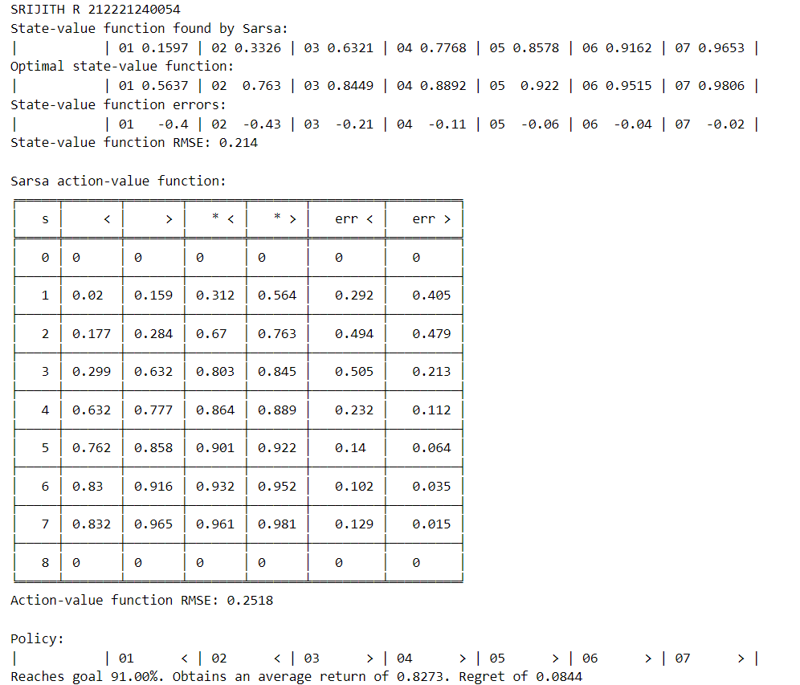

# SARSA Learning Algorithm

## AIM

To develop SARSA RL to train an agent in Gym environment for optimal policy learning.

## PROBLEM STATEMENT

Train agent with SARSA in Gym environment, making sequential decisions for maximizing cumulative rewards.

## SARSA LEARNING ALGORITHM

### Step 1:

Initialize the Q-table with random values for all state-action pairs.

### Step 2:

Initialize the current state S and choose the initial action A using an epsilon-greedy policy based on the Q-values in the Q-table.

### Step 3:

Repeat until the episode ends and then take action A and observe the next state S' and the reward R.

### Step 4:

Update the Q-value for the current state-action pair (S, A) using the SARSA update rule.

### Step 5:

Update State and Action and repeat the step 3 untill the episodes ends.

## SARSA LEARNING FUNCTION

```py
#SRIJITH R 212221240054
def sarsa(env,
          gamma=1.0,
          init_alpha=0.5,
          min_alpha=0.01,
          alpha_decay_ratio=0.5,
          init_epsilon=1.0,
          min_epsilon=0.1,
          epsilon_decay_ratio=0.9,
          n_episodes=3000):
    nS, nA = env.observation_space.n, env.action_space.n
    pi_track = []
    Q = np.zeros((nS, nA), dtype=np.float64)
    Q_track = np.zeros((n_episodes, nS, nA), dtype=np.float64)
    def select_action(state, Q, epsilon):
        if np.random.random() > epsilon:
            return np.argmax(Q[state])
        else:
            return np.random.randint(nA)

    alphas = decay_schedule(init_alpha, min_alpha, alpha_decay_ratio, n_episodes)
    epsilons = decay_schedule(init_epsilon, min_epsilon, epsilon_decay_ratio, n_episodes)
    for e in tqdm(range(n_episodes), leave=False):
        state, done = env.reset(), False
        action = select_action(state, Q, epsilons[e])
        while not done:
            next_state, reward, done, _ = env.step(action)
            next_action = select_action(next_state, Q, epsilons[e])
            td_target = reward + gamma * Q[next_state][next_action] * (not done)
            td_error = td_target - Q[state][action]
            Q[state][action] = Q[state][action] + alphas[e] * td_error
            state, action = next_state, next_action
        Q_track[e] = Q
        pi_track.append(np.argmax(Q, axis=1))
    V = np.max(Q, axis=1)
    pi = lambda s: np.argmax(Q[s])
    return Q, V, pi, Q_track, pi_track
```

## OUTPUT:

### Optimal policy, optimal value function , success rate for the optimal policy.



### State value functions of Monte Carlo method


### State value functions of SARSA learning.


## RESULT:

SARSA learning successfully trained an agent for optimal policy.
